# Customer Churn Analysis and Modelling

## Contents

1. **Exploratory Data Analysis**
    - Description of the dataset
    - The rates of churn
    - Visualise distributions of the numeric features and separate by `Churn` status 
2. **Modelling**
    - Feature Engineering
    - Logistic Regression vs. Tree Based Models aiming to optimise ROC-AUC
3. **Post tuning to optimize a cost function**
    - After choosing a model based on ROC-AUC performance the modelling was extened further by tuning the decision threshold to optimise for a business metric: Minimising money lost from Churning Customers

## Introduction

This document shows an example Data Science project utilising a dataset built around customer churn. The goal of the modelling was to predict customers that are likely to churn, this was then extended to minimise loss from churning customers.

**Dataset:** [Telco Customer Churn](https://www.kaggle.com/datasets/blastchar/telco-customer-churn). A fictional company's data. There are demographic features as well as billing and service information

### Description of Dataset

|                  | datatype   |   nunique | Notes                                                                                 |
|:-----------------|:-----------|----------:|:--------------------------------------------------------------------------------------|
| customerID       | object     |      7043 | Customer ID                                                                           |
| gender           | object     |         2 | Demographic Info                                                                      |
| SeniorCitizen    | int64      |         2 | Demographic Info                                                                      |
| Partner          | object     |         2 | Demographic Info                                                                      |
| Dependents       | object     |         2 | Demographic Info                                                                      |
| tenure           | int64      |        73 | Customer's Tenure (in months)                                                         |
| PhoneService     | object     |         2 | Billing and Service Info                                                              |
| MultipleLines    | object     |         3 | Billing and Service Info                                                              |
| InternetService  | object     |         3 | Billing and Service Info                                                              |
| OnlineSecurity   | object     |         3 | Billing and Service Info                                                              |
| OnlineBackup     | object     |         3 | Billing and Service Info                                                              |
| DeviceProtection | object     |         3 | Billing and Service Info                                                              |
| TechSupport      | object     |         3 | Billing and Service Info                                                              |
| StreamingTV      | object     |         3 | Billing and Service Info                                                              |
| StreamingMovies  | object     |         3 | Billing and Service Info                                                              |
| Contract         | object     |         3 | Billing and Service Info                                                              |
| PaperlessBilling | object     |         2 | Billing and Service Info                                                              |
| PaymentMethod    | object     |         4 | Billing and Service Info                                                              |
| MonthlyCharges   | float64    |      1585 | Charges Amounts                                                                       |
| TotalCharges     | object     |      6531 | Charges Amounts - Notice the dtype is a string. This needs to be converted to numeric |
| Churn            | object     |         2 | Churn Yes/No (Target Variable)                                                        |

## Exploratory Data Analyis

### Class Imbalance of the Target Variable:

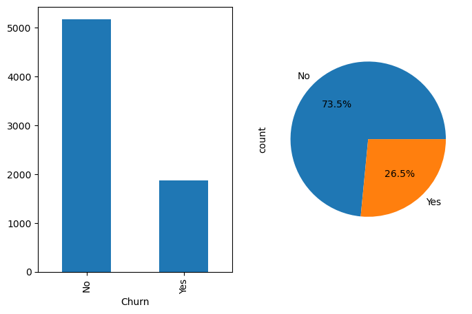

### Comparing Distributions of Churned vs Non-Churned Customers

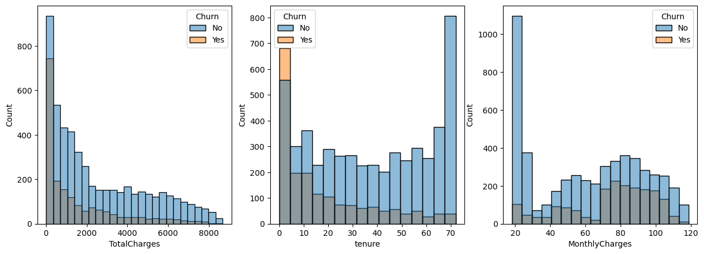

Customers with lower Tenure (and hence Total Charges) were more likely to have churned, this is simply explained by the fact that happy customers are likely to stay subscribed (survivorship bias) - thus we can say tenure *correlates* with satisfaction but we cannot say that customers are gaining satisfaction by staying customers for longer.

Another important factor to consider is the Contract variable: customers on One and Two year contacts cannot leave within 12/24 months respectively without incurring a cost.

### Contract Types and Churn

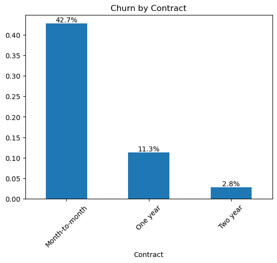

Here we can see that the Contract type has a relationship with Churn

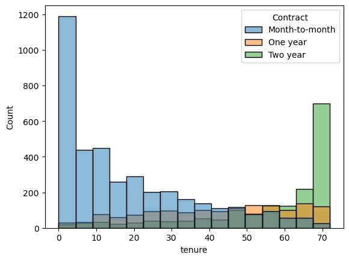

Futhermore, lots of the low-tenure customers are on Month-to-month contracts.

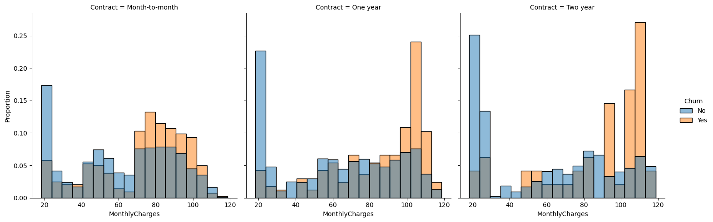

Figure above shows the Monthly charges for the different Contract and the proportion of Churned and Non-Churned customers (The churn groups are normalised within group)

We can see from these plots that there is price sensitivity for each of the groups. 

### Services and Churn

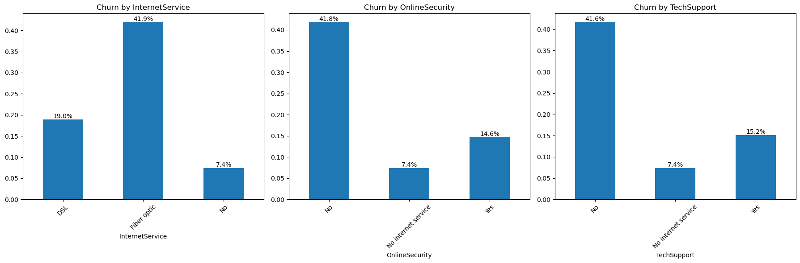

Of all the services, the Internet service, Online security and Tech support have the strongest relationship with Churn

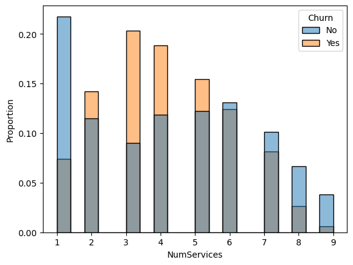

We also see a difference in distribution with the number of services

## Modelling

As part of the modelling the following features were derived:

To start the modelling we need to transform some variables

1. `NewCustomer_Yes` and `TenureGroup`: these features provide a variable to capture what we have seen in the tenure distributions above: that new customers have a higher rate of churn. While it is captured in the `tenure` variable itself, providing extra variables makes it easier for models to capture this effect
2. **N-Gram columns**: Combinations of some the categorical variables - this again makes it easier for models to capture these interaction effects (E.g. customers who are on Month-to-month contracts and not subscribing to Internet service), especially important for linear models which would not be able to
3. `AvgMonthlyCharges` similar to `MonthlyCharges`
4. `NumServices` a count of the number of services the customer subscribes to

### Comparing Logistic Regression to Gradient Boosting

Below the models are compared:

|    | Model               |   CV AUC |    CV Std |
|---:|:--------------------|---------:|----------:|
|  0 | Logistic Regression | 0.848161 | 0.0160863 |
|  1 | Gradient Boosting   | 0.845298 | 0.0172475 |

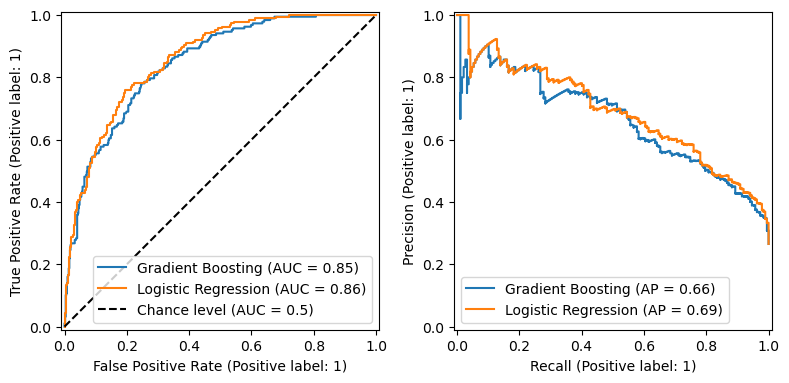

The performance slightly prefers Logistic Regression, however the difference is minimal. The reason why Logistic Regression is used is because this allows for a more simplistic interpretation with the use of the coefficients.

The structure of the model is as follows:

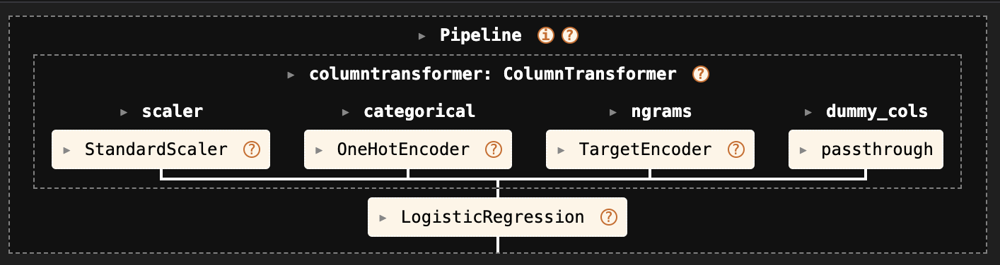

The numerical values (Charges etc.) are Scaled. The categorical variables that are not the interaction N-grams and One-Hot encoded. The N-gram features are Target Encoded. Lastly dummy variables are passthroughed (They are essentially already One Hot Encoded).

### Feature Importance (Linear Coefficients)

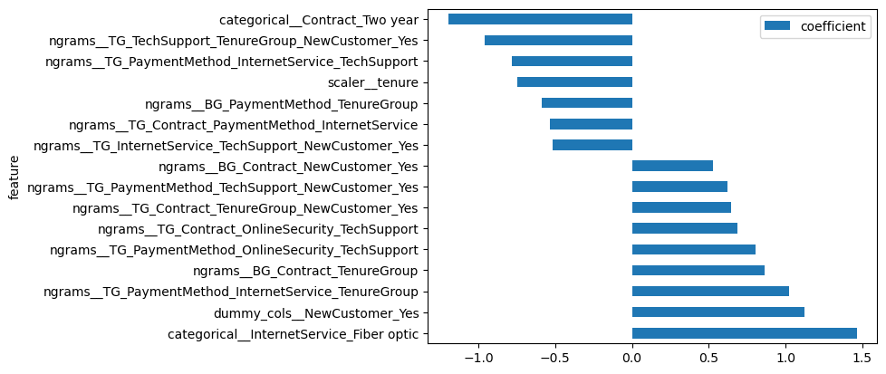

All of the features with a coefficient value of greater than 0.5 are shown here.

We can see that a lot of the features derived from `tenure` are significant, and the services which were found to have higher different rates from the EPA (Online Security and Tech Support) also seem to have ngrams that are significant. Suprisingly the Month-to-month contract variable only seems to appear in the N-gram columns - indicating that it is Contract and Service dependent.

## Optimising Performance for Cost Sensitive Scenario

This model was trained to maximise the Receiving Operating Characteristic Area under the Curve - in short this means that it aims to become the best discriminator between customers who churn and those that won't.

The Classification Report for the model's default (0.5) tuning is shown below

|              |   precision |   recall |   f1-score |   support |
|:-------------|------------:|---------:|-----------:|----------:|
| No Churn     |        0.84 |     0.92 |       0.88 |    518   |
| Churn        |        0.71 |     0.51 |       0.59 |    187   |
| accuracy     |             |          |       0.81 |      705 |
| macro avg    |        0.77 |     0.72 |       0.74 |    705   |
| weighted avg |        0.80 |     0.81 |       0.80 |    705   |

The model predicts a probability of churn and decides that those with a proba over 0.5 are churns and those that are less will not. From the Classification Report above we can see that the accuracy is 80%. However the recall of Churns is only 0.51, while this can be typical in situations where there is class imbalance, is this model optimising for the value of the business?

Given that we do not have a perfect predictor, do we want to consider the cost of failing to identify a churning customer (False Negative) the same as a mistakenly predicting one (False Positive)? As the cost of acquiring new customers is greater than retaining, we can assume that a model which biases recalling more churners would be more relevant for the business.

This is where tuning of the decision threshold becomes relevant. We can input hypothetical costs of False Negatives, False Positives, and True Positives and tune the decision threshold to minimise loss.

The costs are shown in the table: The cost of failing to identify the churning customer is -5, the cost of a False Positive is -1 (cost of retention scheme), the Cost of a True Positive is -2.25 $$expectedretentioncost =  - 1 + (-5 * (1-retention success rate))$$ where the retention_success_rate is 0.75

|  | Predicted: No | Predicted: Yes |
|--|--------------|----------------|
| **Actual: No**  | 0  | -1 |
| **Actual: Yes** | -5 | -2.25|

By creating a cost function based on this table, we can tune a model to optimise the decision threshold for this value.

**The optimised threshold was found to be 0.29**

The classification with the new settings is below

| | precision | recall | f1-score | support |
|:---|---:|---:|---:|---:|
| No Churn | 0.91 | 0.77 | 0.83 | 518 |
| Churn | 0.55 | 0.78 | 0.64 | 187 |
| accuracy | | | 0.77 | 705 |
| macro avg | 0.73 | 0.77 | 0.74 | 705 |
| weighted avg | 0.81 | 0.77 | 0.78 | 705 |

The model is finding more of the customers that Churned (higher recall) however it is making more errors, accuracy is hence lower:

### Demonstrating the Cost Saving

Below is a Confusion Matrix for just the Marginal Predictions (i.e. the predictions where the predicted probability was between 0.29 and 0.5)
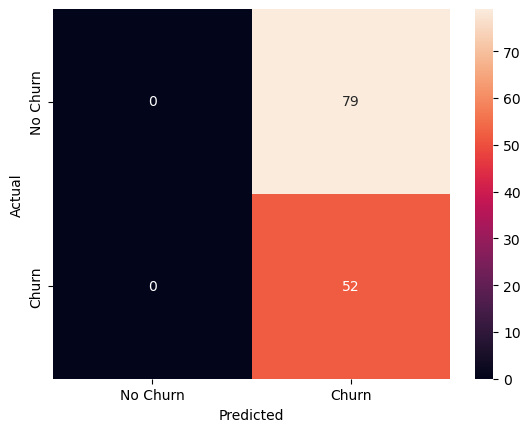

The accuracy of these predictions is 40%, however with the 52 newly identified Churned customers - can the the business make a saving?

$$Cost_{new predictions} = -2.25*Actual Churns + -1 * False Positives$$
$$ -2.25*52 + -1*79 = -196$$

$$ Cost_{old predictions} = -5*FalseNegatives$$
$$ -5*52 = -260$$

Therefore, when we assume that the cost of Churned customers is greater than a retention scheme we see that a model with a lower prediction threshold can make savings when compared with a standard model.

Below we plot the point on the Precision Recall, ROC and Cost score curves with markers showing the values for the different thresholds respectively. The important point being that the model with lower threshold (ergo higher recall and lower precision) minimises the loss shown on the third plot
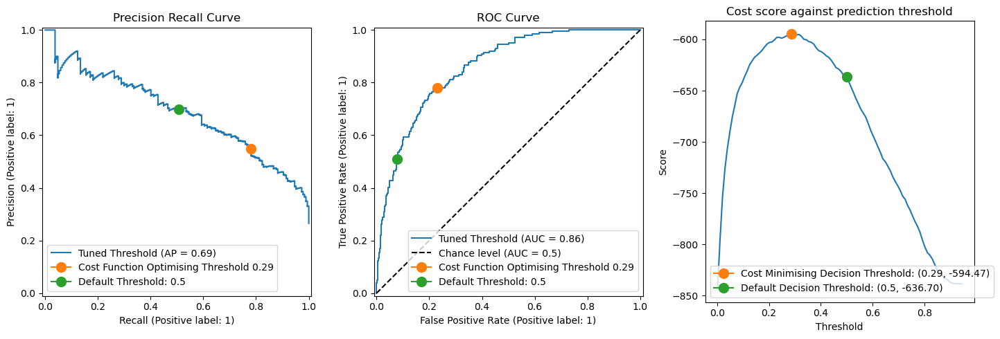